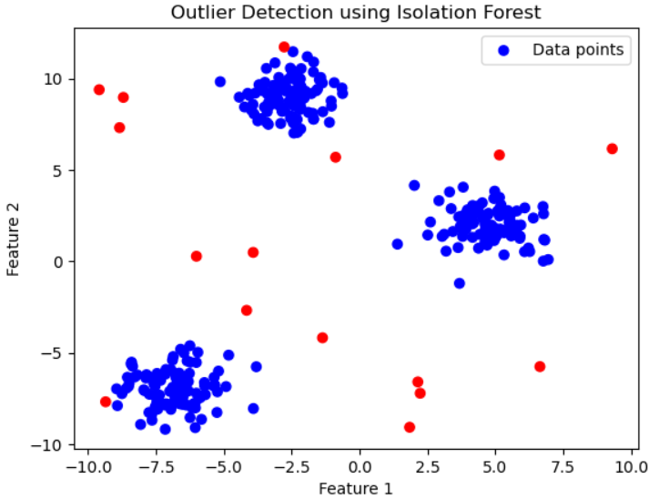

# Outlier Detection using Isolation Forest

This project demonstrates outlier detection using the **Isolation Forest** algorithm, which is suitable for datasets with anomalies or outliers. It includes a step-by-step implementation in Python using a synthetic dataset, and visualizes the inliers and outliers.

## Table of Contents

- [Introduction](#introduction)
- [Dataset](#dataset)
- [Installation](#installation)
- [Implementation](#implementation)
- [Results](#results)
- [Usage](#usage)
- [Contributing](#contributing)

## Introduction

Outlier detection is crucial for identifying anomalous data points that can affect the quality of analysis in various fields such as fraud detection, cybersecurity, and machine learning. This project uses the **Isolation Forest** algorithm, a widely used technique for identifying outliers based on the idea that anomalies are fewer and different from the majority of the data.

## Dataset

For this project, we generate a synthetic dataset using the `make_blobs` function from `sklearn.datasets`. The dataset contains:

- 300 data points grouped into 3 clusters.
- 20 randomly generated anomalous points (outliers).

### Example Data Structure

| Feature 1 | Feature 2 | Outlier |
| --------- | --------- | ------- |
| 1.39      | 4.28      | Inlier  |
| -6.34     | -7.27     | Outlier |

## Installation

To run this project, you need to have Python installed along with the following libraries:

```bash
pip install numpy pandas matplotlib scikit-learn
```

### Libraries Used

- **numpy**: For numerical operations.
- **pandas**: For data manipulation and analysis.
- **matplotlib**: For data visualization.
- **scikit-learn**: For machine learning algorithms, including Isolation Forest.

## Implementation

The project is divided into the following steps:

1. **Importing Libraries**: Necessary libraries are imported, including `IsolationForest` from `sklearn.ensemble`.
2. **Generating Synthetic Dataset**: A dataset with 3 clusters and additional outliers is generated.
3. **Applying Isolation Forest**: The Isolation Forest algorithm is applied to detect outliers in the dataset.
4. **Visualizing the Results**: A scatter plot is used to visualize inliers and outliers.

You can run the project in a Jupyter notebook, where each of these steps is organized into separate code cells.

## Results

Once the Isolation Forest algorithm is applied, it identifies outliers in the dataset. These outliers are marked and plotted on a 2D scatter plot, with outliers highlighted in red and inliers in blue.

### Sample Output



- **Blue points** represent inliers (normal data).
- **Red points** represent detected outliers.

## Usage

To use the code, follow these steps:

1. Clone this repository:
    ```bash
    git clone https://github.com/ahmdmohamedd/outlier-detection-isolation-forest
    ```
2. Navigate to the project directory:
    ```bash
    cd outlier-detection-isolation-forest
    ```
3. Run the Jupyter notebook:
    ```bash
    jupyter notebook
    ```
4. Execute the notebook cells step-by-step to see the results.

You can also adapt the code for any other dataset by loading your data in place of the synthetic data generation step.

## Contributing

Contributions are welcome! If you have suggestions for improvements or want to add more features, feel free to open a pull request or create an issue.
